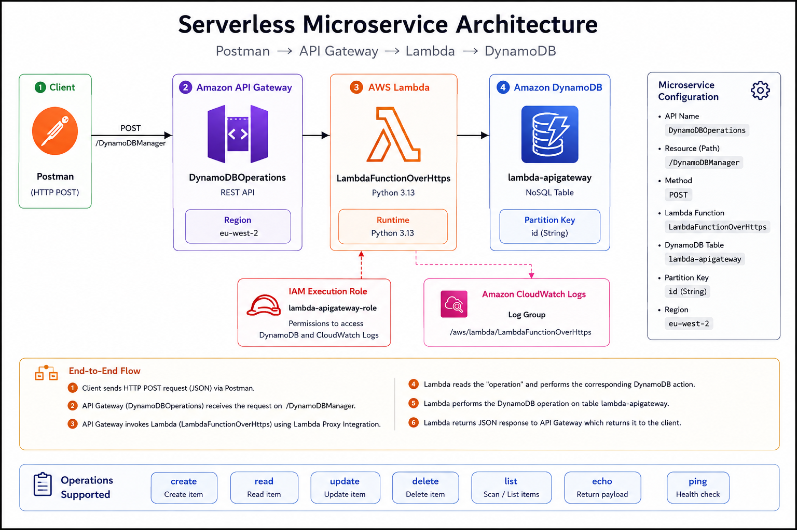
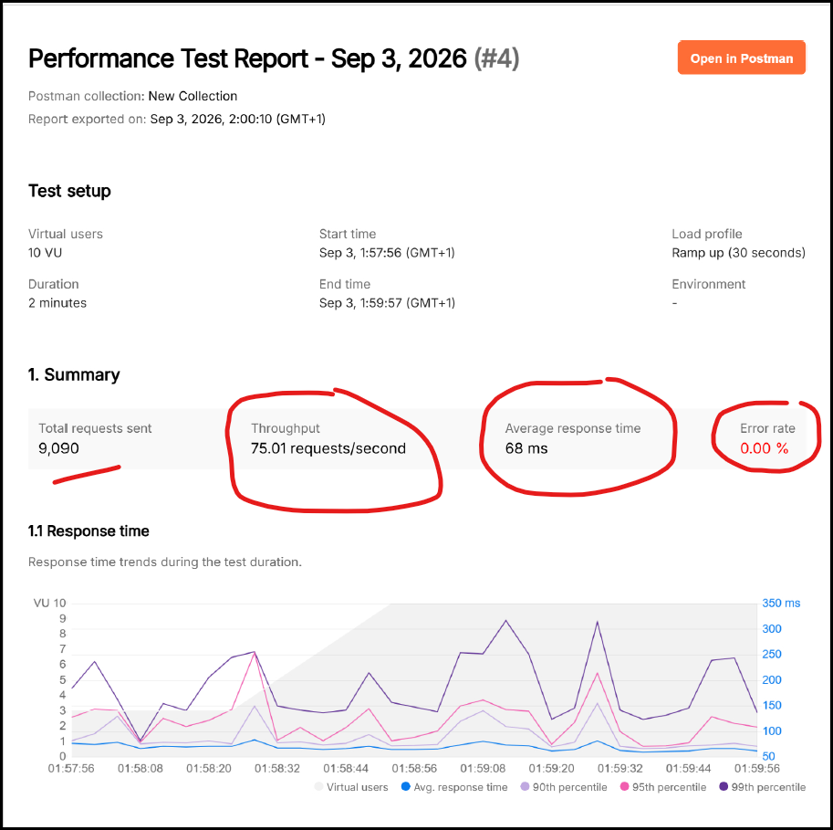

# AWS Serverless Microservice – Performance Testing & Optimisation

## Project Overview

This project demonstrates the build, testing and performance optimisation of a serverless microservice on AWS.

The microservice uses:

**Amazon API Gateway → AWS Lambda → Amazon DynamoDB**

API Gateway exposes the microservice through a REST API. AWS Lambda contains the application logic and performs operations against a DynamoDB table.

The project was then load tested using Postman to measure the performance of the API under concurrent requests.

## Architecture

The serverless architecture consists of:

- **Amazon API Gateway** – exposes the REST API
- **AWS Lambda** – processes requests and contains the application logic
- **Amazon DynamoDB** – provides serverless NoSQL data storage
- **AWS IAM** – provides the Lambda execution role and permissions
- **Amazon CloudWatch** – provides Lambda logging and monitoring

### Microservice Configuration

- API: `DynamoDBOperations`
- Resource: `/DynamoDBManager`
- Method: `POST`
- Lambda function: `LambdaFunctionOverHttps`
- DynamoDB table: `lambda-apigateway`
- DynamoDB partition key: `id`

## Performance Testing

Postman Performance Testing was used to generate concurrent requests against the API.

To provide a like-for-like comparison, both tests used:

- 10 virtual users
- 2-minute test duration
- Ramp Up load profile (30 seconds)
- The same API request and DynamoDB workload

### Test 1 – Baseline

Lambda configuration:

- Memory: **128 MB**
- Timeout: **3 seconds**

Results:

- Total requests: **2,459**
- Throughput: **20.33 requests/second**
- Average response time: **314 ms**
- Error rate: **0.00%**

#### Postman Performance Test – 128 MB

### Test 2 – Increased Lambda Memory

Lambda configuration:

- Memory: **1024 MB**
- Timeout: **5 seconds**

Results:

- Total requests: **9,090**
- Throughput: **75.01 requests/second**
- Average response time: **68 ms**
- Error rate: **0.00%**

#### Postman Performance Test - 1024 MB

## Results

In this load test, increasing the Lambda memory allocation from 128 MB to 1024 MB was associated with:

- Approximately **78% lower average response time**
- Approximately **3.7x higher throughput**
- **0% errors** in both tests

The results demonstrate how Lambda configuration can significantly affect application performance.

Increasing Lambda memory also increases the compute resources available to the function. However, selecting the highest memory setting is not automatically the best architectural decision. Performance should be considered alongside cost and the requirements of the workload.

## What I Learned

This project gave me hands-on experience with:

- Building a serverless microservice using AWS managed services
- Integrating API Gateway with AWS Lambda
- Using Lambda to perform operations against DynamoDB
- Configuring IAM permissions for Lambda
- Testing REST APIs using Postman
- Performing load and performance testing
- Measuring response time, throughput and error rates
- Understanding the relationship between Lambda memory, compute performance and cost
- Applying AWS Well-Architected thinking to performance and cost trade-offs

## Acknowledgements

Completed as part of hands-on learning with Cloud With Raj (CWR), Cohort 9.
